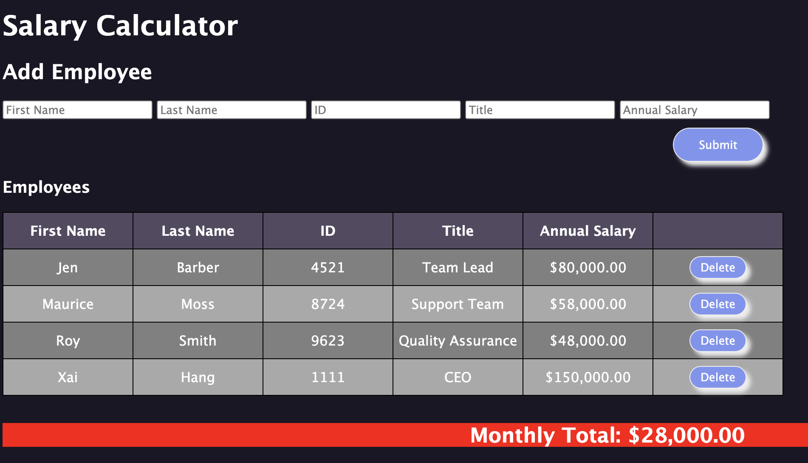

# Salary Calculator

## Description

The application gathers employee's information such as their first name, last name, ID numbers, job titles, and annual salaries. When an employee is added to the database by clicking on the submit button, their information is displayed in a table formation on the browser. If an employee is removed, a "delete" button is available for each employee. Rather it is adding or removing an employee it will calculate employees annual salary and displayed beneath the table as "Monthly Total". If the "Monthly Total" exceeds $20,000.00, the background color of the total monthly cost will turn red. 

## Tools and methods used in this application:
* HTML
* CSS 
* JavaScript
* jQuery 

## Challenges and solutions
* Formatting the annual salary from number value to currency by using the Intl.NumberFormat() method
* Refactoring the render() and onDeleteEmployee() to include .data() method - which is use to attach and store data on elements in a webpage, which can be accessed and manipulated later on.
* To check if the monthly total salary is $20,000.00 or more and change the background color to 'red' if true. A function was created to handle this one task called 'checkTotalSalary' with if/else statements; depending on the valid situation it will add or remove the 'red' background - applied with the addClass() and removeClass() methods. Additional a  class selector 'over-budget' was dynamically added in the css stylesheet and bridge it into the JavaScript file to serve this purpose. 

## CSS styling
* Button: hoover - when hoovered over the buttons it will change color. Additional shadow for backdrop. 
* Background color for general overall, change font color and size
* Table row, when adding employee to the row, every other one will change color 

-----------
## Deployed link: [click here!](https://xaihang.github.io/weekend-jquery-salary-calculator/)

### Wireframe 

My notes can be found [here](https://github.com/xaihang/weekend-jquery-salary-calculator/blob/main/note.txt).

Instructions can be found [here](https://github.com/xaihang/weekend-jquery-salary-calculator/blob/main/INSTRUCTIONS.md).